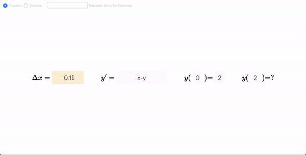

# Eulers-Method-Visualizater
This web app was made for my AP Calculus class. It computes each step of Eulers method and visualizes the the error between Euler's method and the (near) actual function.

> Euler's method is a numerical method to solve first order first degree differential equation with a given initial value.

Built with HTML5, CSS, and vanilla Javascript. Math is LaTexed for your viewing pleasure!

# Usage

Enter a step size, a differential equation, a given value, and the value to compute. Press enter, and scroll down to see the magic:

> 

The calculations can either be in fractions, or can be expressed in decimals (you can specify the precision of the decimal). 
